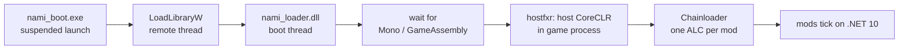

<div align="center">

# 🌊 Nami

**A Unity mod loader (Mono and IL2CPP, Windows x64), written from scratch.**

[](https://dotnet.microsoft.com/download/dotnet/10.0)
[](https://github.com/asanamex/nami)
[](docs/architecture.md)
[](https://github.com/asanamex/nami)
[](LICENSE.md)

*Nami core has no build dependency on BepInEx, HarmonyX, MonoMod, or Mono.Cecil.*

</div>

## What is this

BepInEx plugins run inside the game's old embedded Mono. Nami instead injects a small native loader, waits for Unity to initialize, then **hosts a modern .NET 10 runtime inside the game process** and loads each mod into its own isolated context.
📖 [Tutorial](TUTORIAL.md) · 🌉 [Tide](docs/tide.md) · 🌊 [Wave](docs/wave.md) · 🏛️ [Architecture](docs/architecture.md) · ⚖️ [vs BepInEx](docs/vs-bepinex.md) · 🔬 [Technical deep-dive](docs/technical-difference.md)
📝 [Modding guide](docs/modding.md) (writing mods, config, CLI reference)
Why you might care:

- Mods run on .NET 10 with real isolation: a throwing mod disables itself, the game keeps playing.
- Rebuild a mod and it hot-swaps live. No game restart.
- Typed access to game state (`GameClass`, `GameObject`) plus method patching, on Mono and IL2CPP.

## 30 seconds

```csharp
using Nami;
using Nami.Sdk;

[NamiPlugin]
[PluginInfo("dev.example.greeter", "Greeter", "0.1.0")]
public sealed class GreeterPlugin : NamiPlugin
{
    public override void OnLoad()
    {
        if (!Tide.IsAvailable) return;
        var time = GameClass.Resolve("UnityEngine.CoreModule", "UnityEngine", "Time");
        time.SetStaticFloat("timeScale", 0.5f);   // slow motion
    }
}
```

```powershell
dotnet new install tools/templates/nami-mod
dotnet new nami-mod -n MyFirstMod
nami install "<game>"
nami launch set "<game>\Game.exe" "<game>"
nami run "MyFirstMod\MyFirstMod.csproj" "<game>"
```

That is the whole loop. Details: [TUTORIAL.md](TUTORIAL.md).

## How it fits together



| Piece | What it is |
|---|---|
| 🏠 **BYO runtime** | `net10.0` hosted in-process on Mono *and* IL2CPP titles |
| 🌉 **Tide** | Typed game access, drained on the game main thread ([docs](docs/tide.md)) |
| 🌊 **Wave** | Patching: x64 detours, IL-copy patches, typed IL2CPP hooks ([docs](docs/wave.md)) |
| 🛟 **Safety nets** | Per-mod quarantine, native boot-guard with auto-recovering safe mode |
| 📦 **Tooling** | `nami install/run/pack/doctor`, offline IL2CPP projection, `.nmod` packages |
| 🕰️ **Legacy lane** | Unmodified BepInEx 5.x mods on Mono (`nami inex`), no proxy files |

<details>
<summary><b>Proven in a real game</b> (sample probe log, IL2CPP title, timestamps trimmed)</summary>

```
[B install] hook installed: Il2CppHook(System.Environment::get_TickCount(0), owner=tideprobe-il2cpp-patch)
[F install] full-path hook installed: Il2CppHook(System.Math::Max(2), owner=tideprobe-il2cpp-patch)
[H install] typed hook installed: Il2CppHook(System.Math::Max(2) [typed], owner=tideprobe-il2cpp-patch)
[H passthrough] Max(3,7) = 7, prefix saw (3,7) x1, postfix saw 7 x1
[H argrewrite] Max(3,7)->Max(3,10) = 10, postfix saw 10
[H resultrewrite] Max(3,7) = 238 (byte-visible 238), postfix saw 7
[I install] typed receiver hook installed: Il2CppHook(UnityEngine.GameObject::GetInstanceID(0) [typed], owner=tideprobe-il2cpp-patch)
[I receiver] id = -1548, This seen 31x, dispose-no-throw 31x, postfix saw -1548 x31
[J install] typed boxing hook installed: Il2CppHook(UnityEngine.Debug::Log(1) [typed], owner=tideprobe-il2cpp-patch)
[J boxing] UnityLog returned True, prefix fired 1x, saw Object 1x
TideProbe-IL2CPP-Patch verification complete
```

Gates that run without a game (green on this checkout): `Nami.Cli.Tests` 60/60, `Nami.Tide.Tests` 51/51, `WaveIl2CppTests` 15/15, `ctest smoke` PASS.

</details>

<details>
<summary><b>Full CLI reference</b> (real <code>nami help</code> output, v1.0.0)</summary>

```
nami - a fast, isolated Unity mod loader

usage: nami <command> [args...]

commands:
  version                 print the Nami version
  install  [gameDir] [--from <artifact.zip|url>]
                          install a Nami root next to a game (from the build
                          outputs, or from a self-contained installer artifact
                          produced by `nami pack`)
  pack     [out.zip] [--artifacts <root>]
                          build the self-contained installer artifact (managed +
                          native + bundled .NET runtime, hash-verified manifest)
  launch   set <game.exe> [--steam-id <appid>] [--force] [gameDir]
                          remember which executable is the game
  launch   [offline|steam] [gameDir]
                          run the game with Nami injected (default: offline;
                          steam runs through the Steam client, needs --steam-id set)
  create   [offline|steam] [gameDir]
                          write launchNami.exe + run-with-nami.bat into the nami root
  run      <mod.csproj> [gameDir]
                          build a mod, stage it into nami/mods, and launch the game
  doctor   [gameDir]      check a Nami install and report the environment
  list     [gameDir]      list installed plugins and their state
  interop  images|dump|generate|header [args...] [gameDir]
                          offline IL2CPP typed-projection tooling (dev-time)
  inex     install|enable|disable/status [args...] [gameDir]
                          legacy BepInEx lane (boots BepInEx 5.x in game Mono)
  nmod     info|install [args...] [gameDir]
                          .nmod package distribution (manifest info / install)
```

</details>

## Build from source

Prerequisites: .NET SDK 10.0+. For `native/`: CMake 3.20+, Ninja, C++17 (MinGW-w64; MSVC/Clang untested with these link flags).

```powershell
dotnet build Nami.slnx
cmake -S native -B native/build -G Ninja -DCMAKE_BUILD_TYPE=Release
cmake --build native/build
nami install "<game>"
nami launch set "<game>\Game.exe" "<game>"
nami launch "<game>"
type "<game>\nami\nami.log"
```

`nami launch set` matters: auto-detect picks the largest `.exe`, which can be a crash handler. Layout: `src/` (Sdk, Core, Runtime, Tide, Wave, Cli, Interop), `native/` (injector, loader, hostfxr core, smoke), `tools/` (launch-shim, mod template), `samples/`, `tests/`, `bench/`, `docs/`. `TideProbeIl2CppPatch` and `Nami.Bench` live outside the solution; build via project path.

## Status

Beta. Loading, patching, the bridge, and typed access work in real games on Mono and IL2CPP, but the verified title matrix is small and untested games can surprise you. Run it against your titles and report breakage (engine version, what failed, lines from `nami/nami.log`).

Not yet: BepInEx 6 / IL2CPP legacy lane, legacy-pack distribution, non-Windows platforms. Typed IL2CPP hooks cover the safe `TideValue` subset; `ref`/`out`, arbitrary structs, generics, and virtuals are refused before installation.

## License

Nami is proprietary software under the [NAMI LICENSE](LICENSE.md).
Free use, modification, and distribution for noncommercial purposes, with attribution.
Selling a Nami mod or any other commercial exploitation needs prior written permission:
see [COMMERCIAL.md](COMMERCIAL.md).

<div align="center">

<sub>🌊 made of detours, trampolines, and main-thread drains · <a href="https://github.com/asanamex/nami">asanamex/nami</a></sub>

</div>
