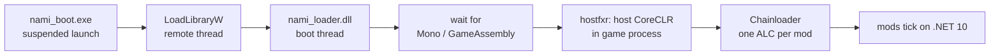
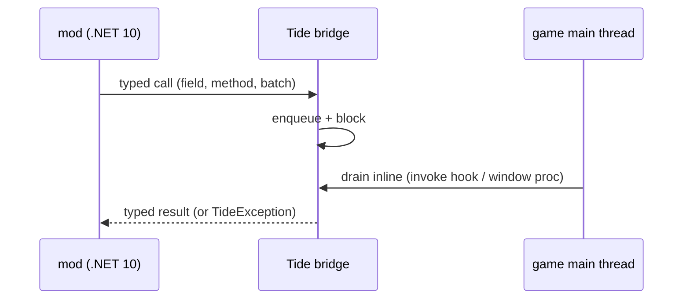

<div align="center">

# 🌊 Nami

**A Unity mod loader (Mono and IL2CPP, Windows x64), written from scratch.**

[](https://dotnet.microsoft.com/download/dotnet/10.0)
[](https://github.com/asanamex/nami)
[](docs/architecture.md)
[](https://github.com/asanamex/nami)
[](tests/Nami.Cli.Tests)
[](tests/Nami.Tide.Tests)

*Nami core has no build dependency on BepInEx, HarmonyX, MonoMod, or Mono.Cecil.
An optional lane (`nami inex`) boots real BepInEx 5.x for legacy mods.*

📖 [Tutorial](TUTORIAL.md) · 🌉 [Tide](docs/tide.md) · 🌊 [Wave](docs/wave.md) · 🏛️ [Architecture](docs/architecture.md) · ⚖️ [vs BepInEx](docs/vs-bepinex.md) · 🔬 [Technical deep-dive](docs/technical-difference.md)

</div>

---

## The idea in 30 seconds

BepInEx plugins run inside the game's old embedded Mono. Nami instead injects a native loader, waits for Unity to initialize, then **hosts a modern .NET 10 runtime inside the game process**. Mods run on .NET 10 with real `AssemblyLoadContext` isolation, crash quarantine, and live hot-reload. Never on the game's runtime.





## What Nami does

| Piece | What it is |
|---|---|
| 🏠 **Bring-your-own runtime** | `net10.0` hosted in-process on Mono *and* IL2CPP titles |
| 🌉 **Tide** | Typed game access (`GameClass`, `GameObject`, `TideValue`, 256-op `TideBatch`) drained on the game main thread |
| 🌊 **Wave** | Patching engine: x64 inline detours, IL-copy prefix/postfix/transpilers, typed IL2CPP hooks |
| 🧩 **Isolation** | One collectible ALC per mod, raw-byte loads (files never locked) |
| 🛟 **Quarantine** | A throwing mod disables itself after 5 consecutive failures; the game keeps running |
| 🛡️ **Boot-guard** | Native-loader crashes are contained; auto-recovering safe mode boots the game clean |
| 🔥 **Hot reload** | Rebuild or drop a DLL into `nami/mods`; it swaps generations live |
| 📊 **Profiler** | Per-mod tick timings (avg/p95/max) in the log and in-process via `Context.Profiler` |
| 📦 **Tooling** | `dotnet new nami-mod`, `nami install/run/pack`, offline IL2CPP projection, `.nmod` packages |
| 🕰️ **Legacy lane** | Unmodified BepInEx 5.x mods on Mono (`nami inex`), no proxy files |

## Verified in a real game

The `TideProbeIl2CppPatch` sample drives hooks A through J against a live IL2CPP title and logs each verdict (timestamps trimmed):

```
[B install] hook installed: Il2CppHook(System.Environment::get_TickCount(0), owner=tideprobe-il2cpp-patch)
[F install] full-path hook installed: Il2CppHook(System.Math::Max(2), owner=tideprobe-il2cpp-patch)
[H install] typed hook installed: Il2CppHook(System.Math::Max(2) [typed], owner=tideprobe-il2cpp-patch)
[H passthrough] Max(3,7) = 7, prefix saw (3,7) x1, postfix saw 7 x1
[H argrewrite] Max(3,7)->Max(3,10) = 10, postfix saw 10
[H resultrewrite] Max(3,7) = 238 (byte-visible 238), postfix saw 7
[I install] typed receiver hook installed: Il2CppHook(UnityEngine.GameObject::GetInstanceID(0) [typed], owner=tideprobe-il2cpp-patch)
[I receiver] id = -1548, This seen 31x, dispose-no-throw 31x, postfix saw -1548 x31
[J install] typed boxing hook installed: Il2CppHook(UnityEngine.Debug::Log(1) [typed], owner=tideprobe-il2cpp-patch)
[J boxing] UnityLog returned True, prefix fired 1x, saw Object 1x
TideProbe-IL2CPP-Patch verification complete
```

And the Tide side on the same title:

```
typed Debug.Log(string) call OK
Application.runInBackground (typed Get<bool>) = True
Screen.orientation (enum via Get<int>) = 1
exception surfaced OK: code=-2 mono=True
TideProbe-IL2CPP verification complete
```

Gates that run without a game (all green on this checkout):

| Suite | Result |
|---|---|
| `Nami.Cli.Tests` | 60/60 |
| `Nami.Tide.Tests` | 51/51 |
| `Nami.Wave.Tests` `WaveIl2CppTests` | 15/15 |
| `native` `ctest smoke` | PASS (incl. boxing-table + stub geometry) |
| `Wave.Bench` | detour/IL-copy vs HarmonyX 2.16.1 with nonzero-exit budgets |

> Status: beta. Loading, patching, the bridge, and typed access work in real games on Mono and IL2CPP, but the verified title matrix is still small. Untested games and Unity versions can surprise you. Run it against your titles and report breakage (engine version, what failed, lines from `nami/nami.log`).

## Try it

Prerequisites: .NET SDK 10.0+. For the `native/` tree: CMake 3.20+, Ninja, a C++17 compiler (MinGW-w64; MSVC/Clang are untested with these link flags).

```powershell
# 1. Build (managed + native)
dotnet build Nami.slnx
cmake -S native -B native/build -G Ninja -DCMAKE_BUILD_TYPE=Release
cmake --build native/build

# 2. Stage a nami root next to the game and remember its exe
nami install "<game>"
nami launch set "<game>\Game.exe" "<game>"

# 3. Launch injected, watch the boot
nami launch "<game>"
type "<game>\nami\nami.log"
```

`nami launch set` matters: auto-detect picks the largest `.exe`, which can be a crash handler. Set it once per game.

<details>
<summary><b>Full CLI reference</b> (real <code>nami help</code> output, v0.1.0)</summary>

```
nami - a fast, isolated Unity mod loader

usage: nami <command> [args...]

commands:
  version                 print the Nami version
  install  [gameDir] [--from <artifact.zip|url>]
                          install a Nami root next to a game (from the build
                          outputs, or from a self-contained installer artifact
                          produced by `nami pack`)
  pack     [out.zip] [--artifacts <root>]
                          build the self-contained installer artifact (managed +
                          native + bundled .NET runtime, hash-verified manifest)
  launch   set <game.exe> [--steam-id <appid>] [--force] [gameDir]
                          remember which executable is the game
  launch   [offline|steam] [gameDir]
                          run the game with Nami injected (default: offline;
                          steam relays to a clean Steam session after exit)
  create   [offline|steam] [gameDir]
                          write launchNami.exe + run-with-nami.bat into the nami root
  run      <mod.csproj> [gameDir]
                          build a mod, stage it into nami/mods, and launch the game
  doctor   [gameDir]      check a Nami install and report the environment
  list     [gameDir]      list installed plugins and their state
  interop  images|dump|generate|header [args...] [gameDir]
                          offline IL2CPP typed-projection tooling (dev-time)
  inex     install|enable|disable/status [args...] [gameDir]
                          legacy BepInEx lane (boots BepInEx 5.x in game Mono)
  nmod     info|install [args...] [gameDir]
                          .nmod package distribution (manifest info / install)
  help                    show this help
```

</details>

<details>
<summary><b>Write your first mod</b></summary>

```powershell
dotnet new install tools/templates/nami-mod
dotnet new nami-mod -n MyFirstMod
dotnet pack src/Nami.Sdk -o artifacts/packages
dotnet pack src/Nami.Tide -o artifacts/packages
nami install "<game>"
nami launch set "<game>\Game.exe" "<game>"
nami run "MyFirstMod\MyFirstMod.csproj" "<game>"
```

```csharp
using Nami;
using Nami.Sdk;

[NamiPlugin]
[PluginInfo("dev.example.greeter", "Greeter", "0.1.0")]
public sealed class GreeterPlugin : NamiPlugin
{
    public override void OnLoad()
    {
        if (!Tide.IsAvailable) return;
        var time = GameClass.Resolve("UnityEngine.CoreModule", "UnityEngine", "Time");
        time.SetStaticFloat("timeScale", 0.5f);   // slow motion
    }
}
```

Full loop with a real game: [TUTORIAL.md](TUTORIAL.md).

</details>

## Repository layout

```
.github/     CI (managed + native jobs)
native/      C++17: injector (nami_boot), in-game loader (nami_loader),
             hostfxr hosting (core/), Tide drains + object ops,
             legacy bootstrap (loader/inex_bootstrap.*), smoke/ self-test
src/
  Nami.Sdk/        Public plugin API (what mods reference)
  Nami.Core/       Chainloader: discovery, graph, ALCs, quarantine,
                   hot reload, per-mod profiler
  Nami.Runtime/    In-game managed bootstrap: Boot.Run
  Nami.Tide/       Typed game access: Tide, GameClass, GameObject, TideValue, TideBatch
  Nami.Wave/       Patching engine: x64 detours, IL-copy patches, typed IL2CPP hooks
  Nami.Cli/        nami tool (install/pack/launch/create/run/doctor/list/interop/inex/nmod)
  Nami.Interop/    Offline IL2CPP interop: global-metadata.dat reader (v24-38) + projection
tools/         launch-shim (launchNami.exe) + dotnet new nami-mod template
samples/       HelloNami + TideProbe + TideProbeIl2Cpp + TideProbeIl2CppPatch (stages A-J)
tests/         Core, Wave, Cli, Tide suites + plugin fixtures
bench/         Loader + patching benchmarks with regression gates
docs/          Architecture, Tide, Wave, BepInEx comparisons
```

`dotnet build Nami.slnx` builds src + tests + fixtures + the listed samples + Wave.Bench + launch-shim. `TideProbeIl2CppPatch` and `Nami.Bench` live outside the solution; build via project path.

## What is missing

Not yet: BepInEx 6 / IL2CPP legacy lane, legacy-pack distribution, non-Windows platforms. Typed IL2CPP hooks cover the safe `TideValue` subset (bool, integers, float, double, string, objects, enums); `ref`/`out`, arbitrary structs, generics, and virtuals are refused before installation. Full boundaries: [docs/tide.md](docs/tide.md), [docs/wave.md](docs/wave.md).

## License

Proprietary / to be decided. Not licensed for redistribution yet.

<div align="center">

<sub>🌊 made of detours, trampolines, and main-thread drains · <a href="https://github.com/asanamex/nami">asanamex/nami</a></sub>

</div>
