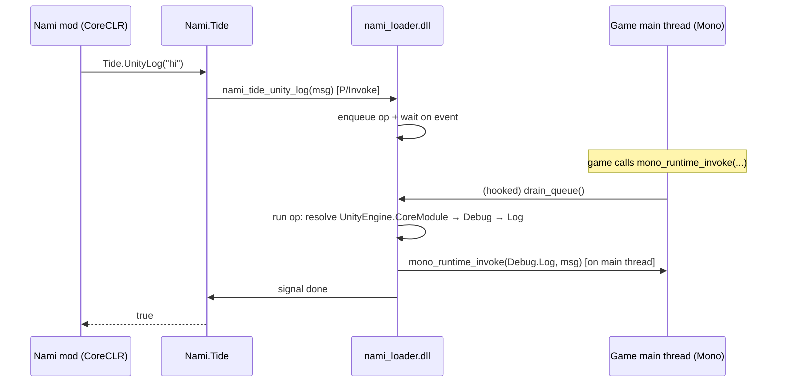

# Tide — the Nami ↔ game bridge

Tide connects mods running on Nami's hosted .NET (CoreCLR) to the game's own managed runtime
(Unity Mono). It is the layer that lets a mod actually *touch the game* — call its code, read
its state — rather than only running sandboxed logic in a parallel universe.

```
src/Nami.Tide/              managed bridge API (what mods call)
native/loader/tide_pump.cpp native main-thread executor: mono_runtime_invoke hook, queue,
                            drain, trampoline
native/loader/tide_ops.cpp  native ops: UnityLog, InvokeStatic (resolve + call game code)
```

---

## 1. The problem: two managed runtimes, one process

Nami deliberately runs mods on a modern .NET 10 (CoreCLR) that it hosts inside the game
process — never on the game's ancient embedded Mono. That gives mods a modern BCL, real
`AssemblyLoadContext`s and hot-reload, but it creates a hard question:

> How does code in Nami's CoreCLR call code in the game's Mono?

Mono's embedding API (`mono_*` exports) is the door, but walking through it from the wrong
thread is fatal. Three approaches were tried and each crashed deterministically before the
working design emerged:

| Approach | Crash | Why |
|---|---|---|
| CoreCLR thread calls Mono directly | **coreclr.dll**, fixed offset | CoreCLR's GC cannot scan a thread that has also touched Mono's Boehm heap (two-GC conflict) |
| Dedicated native thread (Mono-attached) calls Mono | **mono-2.0-bdwgc.dll**, fixed offset (`0x59872`) | Unity's Mono can't execute embedding calls from a foreign `CreateThread` thread — its Boehm GC registration for such threads isn't fully wired (and `GC_register_my_thread` isn't exported) |
| The real bug behind both | same mono offset | `mono_assembly_loaded` takes a **`MonoAssemblyName*`**, not a `const char*` — Mono read the ASCII bytes as a struct and crashed. Fixed with `mono_assembly_name_new` |

Two separate lessons:

1. **Never call Mono from a thread that isn't the game's main thread.** The game main thread
   is the one Mono fully owns (created by Mono, registered with its GC, driven by its
   PlayerLoop).
2. **Check the embedding signatures.** Mono's API is C, untyped at the ABI level — a wrong
   pointer type crashes deep inside Mono at an offset that looks nothing like your bug.

---

## 2. How Tide works

Every Mono call is executed **on the game's main thread**. The mechanism:



1. **Hook.** On first Tide use, `nami_loader.dll` installs a safe native detour over
   `mono_runtime_invoke` — an export the game's main thread calls constantly. The detour is
   built properly: the prologue length is measured by a small x64 decoder (whole instructions
   only, refuses branches/RIP-relative forms), relocated into a trampoline, and the entry is
   patched with `mov rax, imm64; jmp rax` under `VirtualProtect`. No split instructions.
2. **Queue.** A CoreCLR call enqueues a plain-data request (opcode + fixed-size struct) and
   blocks on a per-request event.
3. **Drain.** The next time the game main thread calls `mono_runtime_invoke`, the detour
   drains the queue **inline on the main thread** — running the Mono embedding calls where
   Mono's GC is fully set up — then calls the real `mono_runtime_invoke`.
4. **Fast path.** When nothing is queued, the detour costs one atomic read. Verified: the
   game runs normally with the hook installed (see §4).

The hook is a single global detour; the queue is guarded by a critical section plus an atomic
"work pending" flag so the hot path never takes the lock.

---

## 3. Enabling Tide

Tide is **opt-in**. Add to `<game>/nami/nami.json`:

```json
{
  "enableMonoBridge": true
}
```

On boot, Nami's runtime attaches Tide and fires a `Debug.Log` through the bridge as a
self-test. You should see in `nami.log`:

```
[boot] Tide bridge OK: Unity Debug.Log executed on the game main thread
```

> **Why opt-in?** The bridge runs native code that patches a live game export. It is proven
> on Unity 2022.3 Mono (Windows x64); until more games/versions are verified, it stays behind
> an explicit flag so a bad interaction can never silently affect a game that didn't ask
> for it.

---

## 4. Verified evidence (in-game)

Unity 2022.3.27f1 (Mono), Project Hardline, launched via `nami_boot`:

```
[tide] resolved root=... name_new=... loaded=... class=... invoke=...
[tide] tide op: Debug.Log executed OK
[boot] Tide bridge OK: Unity Debug.Log executed on the game main thread
[chainloader] Loaded dev.nami.samples.hello 0.1.0 (HelloNami.dll)
[boot] chainloader activated: 1 plugin(s) loaded
[dev.nami.samples.hello] HelloNami update tick 120  (running on .NET 10.0.10)
[dev.nami.samples.hello] HelloNami update tick 240
... (ticks continuously)
game alive and stable (~364 MB) for 35s+ with the hook installed
```

`UnityEngine.Debug.Log("hello from Nami's .NET runtime via Tide")` executed on the game's
Mono main thread from Nami's .NET 10, with the game stable and the mod's update loop running
throughout. Native diagnostics land in `<game>/nami/native/nami-tide.log`.

---

## 5. API

```csharp
using Nami.Tide;
```

| Member | Description |
|---|---|
| `bool Tide.IsAvailable` | True when `nami_loader.dll` is loaded (i.e. running in-game under Nami). False in plain unit tests / outside a game. |
| `bool Tide.UnityLog(string message)` | Calls `UnityEngine.Debug.Log(object)` on the game main thread. Returns true if the call ran without a Mono exception. Message is ASCII, truncated to 511 bytes. |
| `bool Tide.InvokeStatic(string assembly, string ns, string klass, string method)` | Calls a **parameterless static** method on a game class. `assembly` may be with or without `.dll`. Returns true if the method ran without a Mono exception. |

Both calls **block** until the game main thread has executed them. This is safe because the
main thread is always pumping through `mono_runtime_invoke` while the game runs; it also
means Tide calls from a mod's `OnUpdate` are synchronous and ordered with the game loop.

**Failure modes** (returns `false`): the loader isn't present; the assembly isn't loaded in
the game; the class or method wasn't found; the method threw a Mono exception. Detailed
reason is logged to `nami-tide.log`.

### Example: a mod that talks to the game

```csharp
using Nami.Sdk;
using Nami.Tide;

[NamiPlugin]
[PluginInfo("dev.example.greeter", "Greeter", "0.1.0")]
public sealed class GreeterPlugin : NamiPlugin
{
    public override void OnLoad()
    {
        if (Tide.IsAvailable)
        {
            Tide.UnityLog("Greeter mod loaded — hello from .NET 10!");
            // Trigger a parameterless static on a game class, e.g. a save/init routine:
            // Tide.InvokeStatic("Assembly-CSharp", "MyGame", "SaveManager", "Flush");
        }
        else
        {
            Context.Log.Warn("Tide unavailable — not running inside a Nami game host?");
        }
    }
}
```

To reference Tide from a mod project, add a reference to `Nami.Tide.dll` (built from
`src/Nami.Tide`) the same way you reference `Nami.Sdk.dll`, and place the DLL next to
`Nami.Sdk.dll` in the game's `nami/` folder. Tide is a shared framework assembly: the
chainloader resolves `Nami.Tide` from the already-loaded copy, so your mod and the runtime
share one instance.

---

## 6. Internals (for contributors)

### Native: `tide_pump.cpp`

- `install_main_thread_drain()` — resolves `mono_runtime_invoke`, measures its prologue with
  `measure_relocatable_prologue()` (whole instructions ≥ 14 bytes; refuses relative branches
  and RIP-relative operands), builds a trampoline (`build_trampoline`), then writes the
  14-byte absolute jump under `VirtualProtect(PAGE_EXECUTE_READWRITE)`.
- `drain_queue()` — runs queued ops on the calling thread. Called from the detour, i.e. on
  the game main thread. Each request carries its own `done` event; the drain signals it after
  the op returns and frees the request.
- `run_on_main_thread(fn, arg, timeout)` — enqueues (critical section + atomic pending flag)
  and waits on the request's event.
- Fast path in the detour: one `InterlockedCompareExchange` on the pending flag; the lock is
  only taken when work is queued.

### Native: `tide_ops.cpp`

- `resolve_api()` — resolves the needed `mono_*` exports via `GetProcAddress` once.
- `find_assembly(name)` — builds a `MonoAssemblyName` via `mono_assembly_name_new` (tries
  with and without `.dll`) and calls `mono_assembly_loaded`. **Do not pass a raw string to
  `mono_assembly_loaded`** — see §1.
- Ops: `TideOp_UnityLog`, `TideOp_InvokeStatic`; each runs `mono_runtime_invoke` with an
  exception out-param and reports success/failure.
- Diagnostics are appended to `nami-tide.log` next to the loader.

### Managed: `Nami.Tide`

P/Invokes `nami_tide_unity_log` / `nami_tide_invoke_static` with fixed-size ANSI buffers
(stack-allocated, NUL-terminated). No Mono knowledge lives in managed code — all of it is in
the native ops.

---

## 7. Troubleshooting

| Symptom | Likely cause / fix |
|---|---|
| `Tide unavailable: nami_loader not loaded` | Not running in a Nami-injected game process (e.g. unit test, or game launched without `nami_boot`). |
| `Tide bridge present but UnityLog failed` | See `nami-tide.log`. Common: assembly not found under that name (Tide tries common variants) or a Mono exception in `Debug.Log`. |
| Game crashes on boot with the bridge on | The `mono_runtime_invoke` detour refused the prologue, or the game's Mono differs from 2022.3. Turn the bridge off (`"enableMonoBridge": false`), confirm the game runs, and report the `nami-tide.log`. |
| `InvokeStatic` returns false | Method must be **static and parameterless**; class/method names are case-sensitive; assembly must be loaded in the game. |

---

## 8. Scope & roadmap

**Current (M1):**
- Windows x64; Unity Mono 2022.3 era verified (Project Hardline).
- Ops: `UnityLog` (string), `InvokeStatic` (parameterless static by name).
- Opt-in via `enableMonoBridge`.

**Next:**
- Static field read/write (int/float/bool/string) — the fastest route to real gameplay mods
  (tweak a stat, flip a flag).
- Method calls with primitive and string arguments.
- Instance access: object handles, calling methods on live `MonoBehaviour`s, reading fields
  off instances.
- A typed projection layer on top so mods get near-native ergonomics instead of raw
  stringly-typed calls.
- Broaden the verified matrix (older/newer Unity Mono, more games); the main-thread-drain
  pattern is expected to carry over.

The same main-thread-drain architecture will inform the IL2CPP bridge later: the lesson —
"run game-runtime calls where the game's runtime owns the thread" — is universal.
