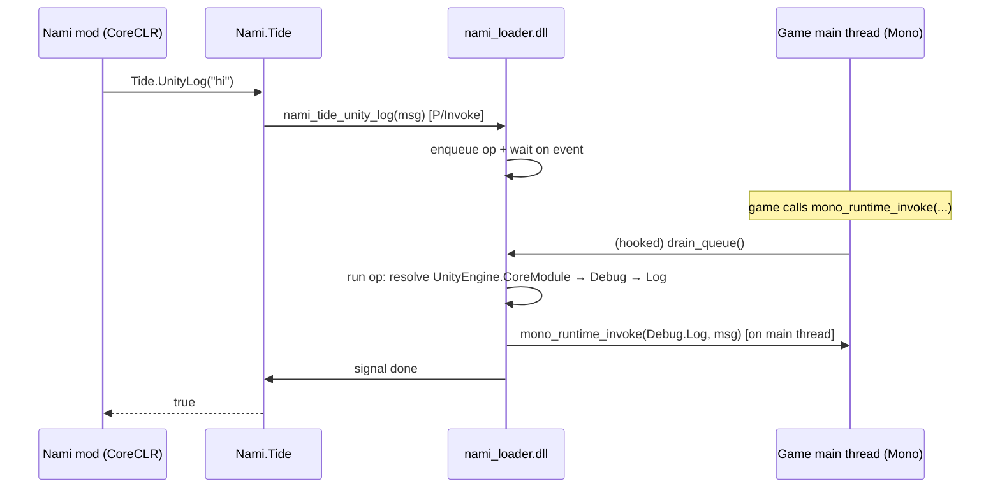

# Tide - the Nami ↔ game bridge

Tide connects mods running on Nami's hosted .NET (CoreCLR) to the game's own managed runtime
(Unity Mono, or IL2CPP - see §9). It is the layer that lets a mod call game code and read
game state.

```
src/Nami.Tide/              managed API: Tide, GameClass, GameObject, TideValue, TideBatch, TideArrays, TideTypes
native/loader/tide_pump.cpp native Mono main-thread executor: mono_runtime_invoke hook,
                            pre/post drain queues, trampoline; shared nami::tide detour
                            toolkit (measure_relocatable_prologue / build_trampoline /
                            install_native_detour - also used by inex_bootstrap.cpp
                            for mono_jit_init*)
native/loader/inex_bootstrap.h/.cpp  nami-inex legacy lane (DOORSTOP_* env, jit detour
                            attempt, watcher thread, late chainloader kick - a Tide
                            drain + detour consumer; see docs/architecture.md)
native/loader/tide_ops.cpp  native ops: UnityLog
native/loader/tide_objects.cpp  Mono typed game access: field/property/method/object ops
native/loader/tide_il2cpp.cpp   IL2CPP main-thread executor: window-proc drain (see §9)
native/loader/tide_il2cpp_ops.cpp  IL2CPP typed game access (mirrors tide_objects.cpp)
native/loader/tide_abi.h    shared value/handle ABI (TideValue, CallRequest, BatchRequest)
native/loader/tide_il2cpp_patch.cpp/.h  typed hook installer: overload resolve, signature store, frame accessors
native/loader/native_stub.cpp/.h  shared detour toolkit: dispatch stubs, near/far jumps, retire-on-unhook
native/loader/il2cpp_boxing.h  shared primitive-boxing table for typed ops and typed hooks
native/loader/tide_member_cache.cpp/.h  name-resolution memoization for both backends (see §6)
```

---

## 1. The problem: two managed runtimes, one process

Nami deliberately runs mods on a modern .NET 10 (CoreCLR) that it hosts inside the game
process - never on the game's embedded Mono. That gives mods a modern BCL, real
`AssemblyLoadContext`s and hot-reload, but it creates a hard question:

> How does code in Nami's CoreCLR call code in the game's Mono?

Mono's embedding API (`mono_*` exports) is the door, but walking through it from the wrong
thread is fatal. Three approaches were tried and each crashed deterministically before the
working design emerged:

| Approach | Crash | Why |
|---|---|---|
| CoreCLR thread calls Mono directly | **coreclr.dll**, fixed offset | CoreCLR's GC cannot scan a thread that has also touched Mono's Boehm heap (two-GC conflict) |
| Dedicated native thread (Mono-attached) calls Mono | **mono-2.0-bdwgc.dll**, fixed offset (`0x59872`) | Unity's Mono can't execute embedding calls from a foreign `CreateThread` thread - its Boehm GC registration for such threads isn't fully wired (and `GC_register_my_thread` isn't exported) |
| The real bug behind both | same mono offset | `mono_assembly_loaded` takes a **`MonoAssemblyName*`**, not a `const char*` - Mono read the ASCII bytes as a struct and crashed. Fixed with `mono_assembly_name_new` |

Two separate lessons:

1. **Never call Mono from a thread that isn't the game's main thread.** The game main thread
   is the one Mono fully owns (created by Mono, registered with its GC, driven by its
   PlayerLoop).
2. **Check the embedding signatures.** Mono's API is C, untyped at the ABI level - a wrong
   pointer type crashes deep inside Mono at an offset that looks nothing like your bug.

---

## 2. How Tide works

Every Mono call is executed **on the game's main thread**. The mechanism:



1. **Hook.** On first `run_on_main_thread` - a Tide op *or* the inex lane's late
   sequence - `nami_loader.dll` installs a safe native detour over
   `mono_runtime_invoke` - an export the game's main thread calls constantly. (The inex
   lane's `mono_jit_init*` detours install even earlier at loader boot, before CoreCLR.) The detour is
   built properly: the prologue length is measured by a small x64 decoder (whole instructions
   only, refuses branches/RIP-relative forms), relocated into a trampoline, and the entry is
   patched with `mov rax, imm64; jmp rax` under `VirtualProtect`. No split instructions.
2. **Queue.** A CoreCLR call enqueues a plain-data request (opcode + fixed-size struct) and
   blocks on a per-request event.
3. **Drain.** The next time the game main thread calls `mono_runtime_invoke`, the detour
   drains the queue **inline on the main thread** - running the Mono embedding calls where
   Mono's GC is fully set up - then calls the real `mono_runtime_invoke`.
4. **Fast path.** When nothing is queued, the detour costs two atomic reads (one
   pre- and one post-invoke). Verified: the
   game runs normally with the hook installed (see §4).

The Tide drain is a single global detour over `mono_runtime_invoke` (the toolkit
supports additional concurrent detours on other targets - the inex lane hooks
`mono_jit_init*` the same way, under its own lock); the queue is guarded by a critical section plus an atomic
"work pending" flag so the hot path never takes the lock (checked pre- and post-invoke).

---

## 3. Enabling Tide

Tide is **opt-in**. Add to `<game>/nami/nami.json`:

```json
{
  "enableMonoBridge": true
}
```

On boot, Nami's runtime attaches Tide and fires a `Debug.Log` through the bridge as a
self-test (this boot gate applies on **both** backends). You should see in `nami.log`:

```
[boot] Tide bridge OK: Unity Debug.Log executed on the game main thread
```

Mod-issued Tide calls don't need the flag beyond that: they route to the auto-detected
backend (`Tide.ActiveBackend`; `IsAvailable` is true whenever the loader is present).
Loader ordering, for reference: (Mono only) `inex::arm` while the game main thread
is still suspended when a payload plus the `inex/enabled` sentinel exist → wait for
runtime → host CoreCLR → managed Tide self-test when
`enableMonoBridge` is set.

> **Why opt-in?** The Mono bridge runs native code that patches a live game export. It
> is proven on Unity Mono (Windows x64) across four titles spanning 2022.3 and Unity 6
> (2022.3.5f1, 2022.3.27f1, 2022.3.34f1, 6000.5.4f1); until more games/versions are verified,
> it stays behind an explicit flag so a bad interaction can never silently affect a game that
> didn't ask for it. The IL2CPP backend (see §9) needs no code patching (it only
> subclasses the game's window) and is auto-detected from the presence of `GameAssembly.dll`
> - but the boot self-test above still requires the flag there too.

---

## 4. Verified evidence (in-game)

Four Unity Mono titles launched via `nami_boot` (three 2022.3, one Unity 6)
- plus one Unity 6 IL2CPP title (see §9).
Representative `nami.log` (Unity 2022.3 Mono title; timestamps elided):

```
[INFO ] [boot] Nami managed runtime booting (nami_root=...\nami)
[INFO ] [boot] attaching Tide bridge...
[INFO ] [boot] Tide bridge OK: Unity Debug.Log executed on the game main thread
[INFO ] [chainloader] Loaded dev.nami.samples.tideprobe 0.1.0 (TideProbe.dll)
[INFO ] [dev.nami.samples.tideprobe] Tide available; typed calls...
[INFO ] [dev.nami.samples.tideprobe] typed Debug.Log(string) call OK
[INFO ] [dev.nami.samples.tideprobe] typed Debug.Log(int) call OK (primitive arg marshaled)
[INFO ] [dev.nami.samples.tideprobe] created GameObject instance (handle=7688)
[INFO ] [dev.nami.samples.tideprobe] GameObject.GetInstanceID() = -62
[INFO ] [dev.nami.samples.tideprobe] Application.runInBackground (typed Get<bool>) = True
[INFO ] [dev.nami.samples.tideprobe] Application.runInBackground set to true via typed Set<bool> OK
[INFO ] [dev.nami.samples.tideprobe] QualitySettings.shadowResolution (enum via Get<int>) = 0
[INFO ] [dev.nami.samples.tideprobe] Environment.GetCommandLineArgs() length = 1
[INFO ] [dev.nami.samples.tideprobe] args[0] = 'C:\...\Game.exe'
[INFO ] [dev.nami.samples.tideprobe] TideProbe boot checks complete; scene probe fires after the scene loads
[INFO ] [dev.nami.samples.hello] HelloNami update tick 120 (running on .NET 10.0.10)
... (ticks continue; ~10 s later the scene probe runs)
[INFO ] [dev.nami.samples.tideprobe] Camera.main found live instance (handle=165640)
[INFO ] [dev.nami.samples.tideprobe] live Camera.name = 'MainCamera'
[INFO ] [dev.nami.samples.tideprobe] TideProbe verification complete
game alive and stable (4000+ ticks), with the hook installed
```

`UnityEngine.Debug.Log("hello from Nami's .NET runtime via Tide")` executed on the game's
Mono main thread from Nami's .NET 10, with the game stable and the mod's update loop running
throughout. Native diagnostics land in the loader's directory (`<game>/nami/native/`
`nami-tide.log` in the standard layout).

The same sequence - bridge OK → typed string/int `Log` → `new GameObject` → `GetInstanceID`
→ generic bool/enum access → array read → (once the scene loads) live `Camera.main` access -
was observed across the titles. Unity 6 initially crashed at the
`GetInstanceID` handle-resolve step - see the GCHandle ABI note in §6 - and has passed every
run since the fix.

---

## 5. API

All Tide public types live in the **`Nami`** namespace (`Tide`, `GameClass`, `GameObject`,
`TideValue`, `TideType`, `TideTypes`, `TideArrays`, `TideBatch`).

```csharp
using Nami;   // Tide, GameClass, GameObject, TideValue, TideTypes, TideArrays, TideBatch
```

| Member | Description |
|---|---|
| `bool Tide.IsAvailable` | True when `nami_loader.dll` is loaded (i.e. running in-game under Nami). False in plain unit tests / outside a game. `Tide.ActiveBackend` (`Mono`/`Il2Cpp`), `IsReady`, and `EnsureReady()` report/drive backend readiness. |
| `bool Tide.UnityLog(string message)` | Calls `UnityEngine.Debug.Log(object)` on the game main thread (both backends; IL2CPP routes through the typed call op). |
| `bool Tide.InvokeStatic(assembly, ns, klass, method)` | Calls a **parameterless** static game method on the main thread (both backends - IL2CPP routes through the typed call op); true if it ran without a game exception. |
| `GameClass GameClass.Resolve(assembly, ns, name)` | Resolve a game class by assembly (with or without `.dll`). The wrapper is cheap; native lookups are memoized (see §6). |
| `GetStaticInt/Long/Float/Double/Bool/String/Object` / `SetStatic...` | Typed static **field or property** read/write (primitives + string + live objects via `GetStaticObject`/`SetStaticObject`). |
| `T? Get<T>(field)` / `Set<T>(field, value)` | **Generic typed access** (static): `T` may be int/long/float/double/bool/string/`GameObject`/any enum (`I32`, or `I64` for `long` enums). No hand-picking `TideType`. |
| `TResult? Call<TResult>(method, params TideValue[])` | Generic typed static call: maps `TResult` to the right `TideType` and converts the result (incl. enums). |
| `CallStatic(method, args...)` | Call a static method with typed args (0–3 args via overloads; N-args via `CallStaticVoid(method, TideValue[])`); returns `void`. Throws on failure. |
| `CallStaticValue(method, args, returnType)` | Like `CallStatic` but returns a `TideValue`; pass the expected `TideType`. |
| `GameObject GameClass.NewObject()` | Create a new instance of the class (runs the parameterless ctor). |
| `GameObject` | Opaque handle to a live game object. Instance method calls with typed returns: `CallIntMethod` (0- or 1-arg) and 0-arg `CallLong/Float/Double/Bool/String/ObjectMethod` (N-args via generic `Call<TResult>(method, params TideValue[])`); void `Call` (0–2 args) / `CallVoid(method, TideValue[])`; `GetInt/GetLong/.../GetString/GetObject` + `SetInt/.../SetString/SetObject`; **generic** `Get<T>`/`Set<T>`/`Call<TResult>`. `Dispose()` is idempotent; use after dispose throws. `GameObject.FromHandle(long)` wraps a raw handle (`0` → `null`). |
| `TideValue` | A typed value. Factories: `FromInt/FromLong/FromFloat/FromDouble/FromBool/FromString/FromHandle`. Readers: `Int32/Int64/Single/Double/Boolean/Handle/String`. Ownership: `FreeNativeReturn()` (frees a native string return after copying) and `FreeStringBuffer()` (only if you retain a `FromString` buffer manually - `Call`/`CallInstance` auto-free arg buffers in a `finally`). |
| `TideTypes.Of<T>()` | Maps a CLR type to its `TideType` (primitives, string, `GameObject`, enums → underlying int, or `I64` for `long` enums). |
| `TideArrays` | Read/write a game-side `System.Array` handle: `GetLength`, typed element reads (`GetInt/GetLong/GetFloat/GetDouble/GetBool/GetEnum/GetString/GetObject`) and writes (`SetInt/SetLong/SetFloat/SetDouble/SetBool/SetString/SetObject` - enum writes via `SetInt`). Works for value-type, enum, string and reference arrays. |
| `TideBatch` | **Batched ops - N game operations in ONE main-thread round trip.** Enqueue up to 256 ops (`EnqueueGetStatic/EnqueueSetStatic/EnqueueCallStatic/EnqueueGetInstance/EnqueueSetInstance/EnqueueCallInstance` - each returns an index), then `Flush()` once. Per-op outcomes via `WasOk(i)`/`CodeOf(i)`; typed result readers `GetInt(i)/GetLong(i)/GetFloat(i)/GetDouble(i)/GetBool(i)/GetHandle(i)/GetString(i)/GetObject(i)`. A failing op does not abort the batch. `Dispose()` frees all unmanaged memory (idempotent); **read string results before disposing**. Enqueue-after-flush, double-flush, and use-after-dispose throw. |

**Blocking semantics**: every call blocks until the game's main thread has executed it (Mono:
pumped through `mono_runtime_invoke`; IL2CPP: drained from the window procedure - see §9).
The hop itself is the dominant per-call cost, so mods that touch several members per tick
should use `TideBatch` (one round trip for the whole tick's worth of ops).
String **arguments** travel in caller-allocated UTF-8 buffers that `Call`/`CallInstance`
free automatically; string **returns** are native buffers you must copy and free with
`TideValue.FreeNativeReturn()` (Mono: `mono_string_to_utf8` + `nami_tide_free`; IL2CPP:
`malloc`'d UTF-8 + `nami_il2cpp_free`).

**Failure**: **every** failing op throws `TideException` (including void calls - no silent
failures). `TideException.Code` carries the native result (`-1` aliases not-found/invalid-arg/not-ready,
`-2` the game method threw - Mono or IL2CPP, `-3` pump unavailable), and when the game threw, the
exception's `.Message` includes the game exception's ToString (type + message + stack).
`TideException.IsMonoException` is true when the game method itself threw (code -2,
either backend). Full diagnostics are also in
`nami/native/nami-tide.log`.

**Marshaling**: on both backends, method calls are **overload- and signature-aware**: the target method is
selected by matching argument types to the method's parameter types (exact matches win;
`object` params accept boxed primitives; impossible bindings like a primitive→`string` are
rejected), and primitive values passed to reference-typed parameters (`object`, interfaces,
base classes) are **boxed automatically** - e.g. `CallStatic("Log", TideValue.FromInt(5))`
correctly calls `Debug.Log(object)` with a boxed `Int32`.

**Enums**: int-backed game enums are read/written through the integer accessors
(`GetStaticInt`/`Get<int>`/`GetEnum`) - the value is the underlying `int`. Enum-typed method
arguments are passed as their underlying value. `long`-backed enums map to `I64`;
reading an int-backed enum as `I64` yields no value (native `Void`, managed `0`).

**Arrays**: an array-typed field/property/method return arrives as a `GameObject` handle;
use `TideArrays` for length and typed element access. Element reads use
`System.Array.GetValue` on Mono; on IL2CPP they go through native `Il2CppArray` access
(`+0x20`), because `GetValue/SetValue` throw there.

### Example: a mod that touches the game

```csharp
using Nami;
using Nami.Sdk;

[NamiPlugin]
[PluginInfo("dev.example.greeter", "Greeter", "0.1.0")]
public sealed class GreeterPlugin : NamiPlugin
{
    public override void OnLoad()
    {
        if (!Tide.IsAvailable) return;

        // Static field read/write:
        var time = GameClass.Resolve("UnityEngine.CoreModule", "UnityEngine", "Time");
        float scale = time.GetStaticFloat("timeScale");
        time.SetStaticFloat("timeScale", 0.5f);   // slow motion!

        // Create a live GameObject and call an instance method:
        var goClass = GameClass.Resolve("UnityEngine.CoreModule", "UnityEngine", "GameObject");
        using var go = goClass.NewObject();
        int id = go.CallIntMethod("GetInstanceID");
        Tide.UnityLog($"made GameObject #{id}");
    }
}
```

To use Tide from a mod project, reference the `Nami.Tide` NuGet package (the `dotnet new
nami-mod` template already does). Tide is a shared framework assembly: the chainloader
resolves `Nami.Tide` from the already-loaded copy (the loader ships `Nami.Tide.dll` in the
nami root), so your mod and the runtime share one instance - `nami run` therefore skips
copying `Nami.*` DLLs from a mod's output into `mods/`.

---

## 6. Internals (for contributors)

### Native: `tide_pump.cpp`

- `install_main_thread_drain()` - resolves `mono_runtime_invoke`, measures its prologue with
  `measure_relocatable_prologue()` (whole instructions ≥ 14 bytes out of a ≤32-byte scan;
  with the default flags it refuses VEX/EVEX/XOP, relative branches, `ret`/`int3`, unknown
  `0F`-prefixed opcodes, and RIP-relative operands), builds a trampoline
  (`build_trampoline`), then writes the 14-byte absolute jump under
  `VirtualProtect(PAGE_EXECUTE_READWRITE)`. Installation is
  serialized under an SRW lock (concurrent first calls are safe; the queue critical section is
  initialized once). The same measure/build pair backs the generic `install_native_detour`
  (own SRW lock) used by the inex lane; the drain installer inlines its own patch sequence.
- `drain_queue()` - runs the pre queue on the calling thread. Called from the detour, i.e. on
  the game main thread, before the original invoke. `drain_post_queue()` runs the post
  queue after the original returns (outside the nested frame); it clears the pending flag
  only when both queues are empty. The drain sets a reentrancy flag while running
  (`IsTideOnMainThread()`), so a Tide call made FROM the game main thread (e.g. a mod hook
  running on it) executes **inline** instead of queueing-and-deadlocking.
- `run_on_main_thread(fn, arg, timeout_ms = 0, flags = RequestFlag_None)` - enqueues
  (pre queue, or post queue when `flags` has `RequestFlag_PostInvoke`) and waits on the
  request's event (`timeout_ms <= 0` waits forever). When called from inside the drain
  (main thread), it runs `fn` inline instead of waiting on itself.
- Fast path in the detour: one `InterlockedCompareExchange` on the pending flag; the lock is
  only taken when work is queued.

### Native: `tide_ops.cpp`

- `resolve_api()` - resolves the needed `mono_*` exports via `GetProcAddress` once.
- `find_assembly(name)` - builds a `MonoAssemblyName` via `mono_assembly_name_new` (tries
  with and without `.dll`) and calls `mono_assembly_loaded`. **Do not pass a raw string to
  `mono_assembly_loaded`** - see §1.
- Ops: `UnityLog`; diagnostics are appended to `nami-tide.log` next to the loader.

### Native: `tide_objects.cpp` (typed game access)

- `CallRequest` / `TideValue` (see `tide_abi.h`): one op entry (`nami_tide_object_op`) with
  sub-ops for field/property get/set, static/instance invoke, new-object and handle free.
- **Object handles**: objects cross the boundary as opaque 64-bit handles backed by Mono
  GCHandles (pinned via `mono_gchandle_new_v2`). CoreCLR never holds raw MonoObject pointers;
  the game GC keeps handled objects alive.
  - **GCHandle ABI note**: Tide uses the `mono_gchandle_*_v2` variants, not the legacy
    `mono_gchandle_*` entry points. Newer Unity Mono (Unity 6) stores handles as 64-bit
    encoded pointers into a page table that can live **above 4 GB**; the legacy entry points
    truncate the handle to its low 32 bits (`mov %ecx`) and fault on such handles (observed as
    an AV inside `mono_gchandle_get_target` at boot on Unity 6). The `_v2` variants are
    full-64-bit and are exported by both old (2022.3) and new (Unity 6) Mono builds.
- **Values**: typed slots (`TideValue`) - a 4-byte tag plus a 16-byte payload union
  (i32/i64/r4/r8/bool/string/object). Strings travel as caller-owned UTF-8 buffers read on the
  main thread; string returns are `mono_string_to_utf8` buffers the managed side frees via
  `nami_tide_free` (IL2CPP: `malloc`'d UTF-8 via `nami_il2cpp_free`).
- **Hierarchy-aware member lookup**: `mono_class_get_method_from_name`/`field` only search
  the class itself, so inherited members (e.g. `GameObject.GetInstanceID` on
  `UnityEngine.Object`) were missed; Tide walks `mono_class_get_parent` up the chain.
- **Signature-aware invoke**: before an invoke, Tide reads the target method's signature
  (`mono_method_signature`/`mono_signature_get_params`) to (a) pick the overload whose
  parameter types best match the passed value types (same-name/same-arity overloads no longer
  bind arbitrarily), and (b) **box primitives** into `System.Int32`/etc. objects when the
  parameter is a reference type (`object`, string, interface, base class) - e.g. an `int`
  passed to `Debug.Log(object)` is boxed, not passed as a raw value pointer.
- **Property fallback**: when a "field" name is not a field, Tide resolves it as a property
  and uses its get/set method.
- **Batch execution**: `nami_tide_object_op_batch` / `nami_il2cpp_object_op_batch` take a
  `BatchRequest` (array of up to 256 `CallRequest` pointers + a caller-owned codes array) and
  run every request inside ONE main-thread round trip (standard drain for Mono, the
  window/IL2CPP executor for IL2CPP). A failing op never aborts the batch: per-op codes land
  in `codes[i]` and each request's own result fields are filled exactly like the single-op
  path.

### Native: `tide_member_cache.cpp` (resolution memoization)

- Name-based member resolution (class from assembly+namespace+name, method in hierarchy,
  typed-overload selection, field, property) used to run on every op; per-tick mods paid the
  same `mono_class_from_name` chains (or `il2cpp_*` equivalents) five times a tick.
- `tide_member_cache` memoizes those lookups for the loader's lifetime: an SRWLOCK-guarded
  open-addressing map (linear probing, power-of-two capacity starting at 256, grows at 3/4
  load) keyed by kind tag + integer keys + the member-name strings. Both backends share the
  instance - Mono uses tags `0x1000000000000000`+1..5 (class, method, typed-method, field, property), IL2CPP `0x2000000000000000`+1..4 (class, method, typed-method, field), so keys never collide;
  typed-overload entries fold an FNV-1a hash of the argument-type mask into the key.
- Results - including **not-found** - are cached: Mono/IL2CPP metadata never unloads, so a
  negative result stays valid. On a miss the caller's resolver runs under the lock and must
  call the `*_uncached` variants (no recursion). The op paths in `tide_objects.cpp` and
  `tide_il2cpp_ops.cpp` funnel every lookup through cached `find_*` wrappers; first use
  resolves, every repeat is a hash hit.

### Managed (`Nami.Tide` assembly, `Nami` namespace)

- `Tide` - availability (`IsAvailable`, `ActiveBackend`, `IsReady`, `EnsureReady`),
  `UnityLog`, `InvokeStatic` (parameterless static calls).
- `GameClass` - resolve a class, typed static field/property access, static calls,
  `NewObject`, generic `Get<T>`/`Set<T>`/`Call<TResult>`.
- `GameObject` - opaque handle; typed instance field/property access, typed instance method
  calls, generic `Get<T>`/`Set<T>`/`Call<TResult>`, `Dispose` (frees the handle),
  `FromHandle`, `IsDisposed`.
- `TideValue` / `TideType` / `TideTypes` - the typed marshaling values + the CLR↔`TideType`
  mapper; `TideArrays` - game-side array access.
- `TideBatch` - enqueue up to 256 ops, one `Flush()` = one main-thread round trip
  (`nami_tide_object_op_batch` / `nami_il2cpp_object_op_batch`); per-op codes + typed result
  readers; strict unmanaged-memory ownership (string args freed on dispose, string returns
  must be read before dispose).
- The typed object ops P/Invoke a `CallRequest` (fixed name buffers + pointers to pinned
  `TideValue` arrays); `UnityLog`/`InvokeStatic` P/Invoke plain buffers instead. No Mono
  knowledge lives in managed code - all of it is in the native ops.

---

## 7. Troubleshooting

| Symptom | Likely cause / fix |
|---|---|
| `Tide unavailable: nami_loader not loaded` | Not running in a Nami-injected game process (e.g. unit test, or game launched without `nami_boot`). |
| `Tide bridge present but UnityLog failed` | See `nami-tide.log`. Common: assembly not found under that name (Tide tries common variants) or a Mono exception in `Debug.Log`. |
| Game crashes on boot with the bridge on | The `mono_runtime_invoke` detour refused the prologue, or the game's Mono differs from the verified set (2022.3.x, 6000.x). Triage the three logs: `nami/native/nami-tide.log` (Tide), `nami/native/nami-inex.log` (legacy lane - including jit-prologue refusal and BepInEx payload issues), `nami/native/nami-loader.log` (which lane armed). Turn the bridge off (`"enableMonoBridge": false`) - note this does **not** disable an enabled inex lane - confirm the game runs, and report the logs. |
| `TideException: op ... failed (code -1)` | Member not found (check assembly/class/member names, case, arity) or an unsupported value type. Codes are logged in `nami/native/nami-tide.log`. |
| Calling the singular `Object.FindObjectOfType` aborts the game | Known Unity boundary, not a Tide bug: the singular wrapper aborts (`0xe0000001`) when invoked from outside managed game code - drain pre/post queues and the window procedure alike. Tide's `FindObject` therefore runs `FindObjectsOfType` + element 0, which returns cleanly (verified on 2022.3.27f1). Use `GameClass.FindObject()`; avoid invoking the singular wrapper through Tide. |

---

## 8. Scope & roadmap

**Current (verified in-game on Unity Mono 2022.3.5f1 / 2022.3.27f1 / 2022.3.34f1 and
Unity 6 / 6000.5.4f1):**
- Windows x64; opt-in via `enableMonoBridge`.
- Typed static **field or property** read/write (int/long/float/double/bool/string/object) and
  **generic** `Get<T>`/`Set<T>` (incl. int-backed enums).
- Static/instance method calls with typed args; **overload- and signature-aware** (exact
  overloads win; `object` params box primitives; impossible bindings rejected); **typed
  instance/static returns** (int/long/float/double/bool/string/object).
- **Enum values**: read/write as their underlying `int` through the integer accessors.
- **Array values**: a game `System.Array` arrives as a handle; `TideArrays` provides
  length + typed element read/write (value/string/enum/reference arrays) via
  `System.Array.GetValue/SetValue`.
- **Batched round trips**: `TideBatch` queues up to 256 field/property/method ops and drains
  them in ONE main-thread round trip (both backends) - a mod reading five fields per tick
  pays one hop instead of five (the thread-hop, not marshaling, dominates bridge cost).
- **Cached resolution**: member-name lookups are memoized in the native loader
  (`tide_member_cache`, process lifetime, incl. negative results), and the dev-time
  `nami interop generate` projection materializes each `GameClass` lazily and caches it -
  resolution runs once per member/type, not per call.
- **Object creation** (`new GameObject()`), object-typed field/property reads of live
  UnityEngine objects (`Camera.main` etc.), GC-handle-backed handles, idempotent `Dispose`.
- **Scene-object discovery**: live scene objects are reachable through static accessors and
  object-typed property/field reads (`Camera.main` → real `MainCamera`, verified on a
  Unity 2022.3 Mono title),
   and through `GameClass.FindObject()` - first loaded object of a class via
   `FindObjectsOfType` + element 0 (verified on a Unity 2022.3 Mono title: found the same
   `Main Camera` as `Camera.main`). Name search (`GameObject.Find`) works through the
   normal invoke path.
- **No silent failures**: every failing op throws `TideException` with a `Code` and, for Mono
  exceptions, the exception's ToString (type + message + stack) in the message.
- `UnityLog`.

In-game evidence (`nami.log`, Unity 2022.3 Mono title - see §4 for the full transcript):
```
typed Debug.Log(string) call OK
typed Debug.Log(int) call OK (primitive arg marshaled)
created GameObject instance (handle=7688)
GameObject.GetInstanceID() = -62
Application.runInBackground (typed Get<bool>) = True
QualitySettings.shadowResolution (enum via Get<int>) = 0
Environment.GetCommandLineArgs() length = 1
args[0] = 'C:\...\Game.exe'
Camera.main found live instance (handle=165640)
live Camera.name = 'MainCamera'
TideProbe verification complete
game alive and stable (4000+ ticks)
```

**Scene-object discovery - via FindObjectsOfType at a frame boundary.** The scene list
is iterable from outside managed game code, but only with two constraints, both
verified empirically on 2022.3.27f1: (1) the call must run with zero `mono_runtime_invoke`
frames on the stack - the invoke drain (pre- *and* post-queue) still nests inside the
game's in-flight invoke, so `FindObject` goes through the window-proc executor
(`nami_tide_object_op_window`, 30 s timeout; needs a visible game window); (2) it must
be the *plural* `FindObjectsOfType` + element 0 - the singular `FindObjectOfType`
wrapper aborts the process (`0xe0000001`) from outside managed code in every tested
context, while the plural path, `GameObject.Find(name)`, and all other typed ops run
fine nested. `GameClass.FindObject()` implements exactly this (active objects only,
null on miss); the TideProbe scene step logs both routes so they can be compared
(it finds the same `Main Camera` as `Camera.main`).

**Next:**
- Broaden the verified matrix (older/newer Unity Mono, more games); the main-thread-drain
  pattern is expected to carry over.

---

## 9. IL2CPP backend (Unity IL2CPP titles)

Nami also runs on **IL2CPP** games (`GameAssembly.dll` present, no Mono). The full
`GameClass` / `GameObject` / `TideValue` API is identical - `Tide.ActiveBackend` reports `Il2Cpp`,
and every typed op (`TideObjectOp.Call`/`CallInstance`, including `UnityLog`/`InvokeStatic`)
routes to the IL2CPP backend automatically, with the same overload scoring as Mono.

**Execution model (empirically established on real IL2CPP titles - Unity 2020.3 and
6000.0):** IL2CPP compiles game scripts to native code, so unlike Mono there is
*no* exported per-frame managed dispatch (24 instrumented exports - `runtime_invoke`,
`class_init`, `object_new`, `string_new`, `value_box`, `array_new`, `thread_attach`,
`gchandle_*`, `liveness_*` - were all silent over 35 s of live gameplay), and *no* VM API is
safe from a worker thread (even `domain_assembly_open` AVs from an attached thread). The safe
execution context is the **game's main thread inside its window procedure**: Nami subclasses
the game's main window and drains a work queue from a `WM_NAMI_DRAIN` message, so every op
runs on the main thread with no `runtime_invoke` frame on the stack. This is the window-proc
drain (`native/loader/tide_il2cpp.cpp`).

**Verified on a Unity 6000.0 IL2CPP title (real IL2CPP)** - the `TideProbeIl2Cpp` sample
passes end to end with the game stable:

```
[dev.nami.samples.tideprobe-il2cpp] Tide available; backend=Il2Cpp
[dev.nami.samples.tideprobe-il2cpp] typed Debug.Log(string) call OK
[dev.nami.samples.tideprobe-il2cpp] Tide.UnityLog returned True
[dev.nami.samples.tideprobe-il2cpp] Application.runInBackground (typed Get<bool>) = True
[dev.nami.samples.tideprobe-il2cpp] Screen.orientation (enum via Get<int>) = 1
[dev.nami.samples.tideprobe-il2cpp] Environment.GetCommandLineArgs() length = 1
[dev.nami.samples.tideprobe-il2cpp] args[0] = 'C:\...\Game.exe'
[dev.nami.samples.tideprobe-il2cpp] exception surfaced OK: code=-2 mono=True
[dev.nami.samples.tideprobe-il2cpp]   ... System.FormatException: Input string was not in a correct format.
[dev.nami.samples.tideprobe-il2cpp] TideProbe-IL2CPP verification complete
game alive and stable (60+ s post-probe, zero crashes)
```

**IL2CPP API notes that matter (all verified):**
- Exports are `E9` jmp-thunks; call the **export address** (not a "followed" body - Unity
  6000's internal register conventions break direct body calls).
- `il2cpp_domain_assembly_open` returns an **assembly**; the image comes from
  `il2cpp_assembly_get_image`.
- GC handles (`il2cpp_gchandle_new`/`get_target`/`free`) are **full 64-bit page-table
  indices** - truncating to 32 bits AVs on lookup (same class of bug as Unity 6 Mono).
- C# properties have no reflection API: reads/writes fall back to `get_X` / `set_X` method
  invokes.
- Array elements are accessed natively (`Il2CppArray` items at `+0x20`, element size from
  `il2cpp_class_get_element_class` + `il2cpp_array_element_size`) rather than via
  `System.Array.GetValue/SetValue`, which throw on IL2CPP.
- Exceptions surface via `System.Exception.ToString()` invoked on the exception object
  (`il2cpp_format_exception` crashes in the window-proc context).
- Metadata may be encrypted on Unity 6 titles (offline parsing is then impossible); the
  runtime path needs no metadata file.

The Mono backend is untouched: `Tide.ActiveBackend == Mono` on Mono titles and everything
behaves as documented above (regression-verified on a Unity 2022.3 Mono title).

### Patching IL2CPP methods (WaveIl2Cpp, v1)

`Wave.Patch` is a CoreCLR engine - it patches *managed* methods by copying IL. An IL2CPP
method is native x64 code in GameAssembly.dll, so patching it needs a different engine:
`WaveIl2Cpp` (Nami.Wave) resolves the `Il2CppMethodInfo` for a class method
(`il2cpp_class_get_method_from_name`, by arity), takes its native entry (`methodPointer`
- the first field in metadata v24-v39), follows leading jump thunks (shared-generic
stubs, same rule as the exports), and installs a **dispatch-stub detour**
(`native/loader/native_stub.cpp` - the shared Tide detour toolkit: 14-byte absolute
jump preferred, with a 5-byte near-jump fallback for short prologues; RIP-relative
operands - including 0F-prefixed SIMD loads - are relocated with disp32 fixup, and
trampolines are allocated within ±2GB of the target so the fixups always reach; exact
restore on unhook). This covers IL2CPP leaf getters (`mov eax, [rip+x]; ret`) and
Unity 6 lazy-init thunks (`sub rsp,0x28; mov rax,[rip+holder]; test; jne …`); only
prologues under 5 clean bytes refuse (never corrupt).

- **ABI (v1, honest)**: the callback runs on the game's main thread (window-proc
executor) with the RAW argument registers - `args[0]` is `this` (an `Il2CppObject*`)
for instance methods, else the first parameter; only 4 register args are exposed
(stack args are not). Returning `true` skips the original (skip return value is 0).
No argument marshaling in v1.
- **Full path (`WaveIl2Cpp.HookFull`)** adds result observation/rewriting and ALL
arguments (register + stack, up to 12): a prefix runs first (may skip - optionally
with a replacement written into the 2-slot result pointer: rax bits / xmm0 bits per
`Il2CppReturnKind`), then the ORIGINAL is called through the trampoline (its result
saved), then a postfix may rewrite the result the caller receives. The stub frame
keeps every args buffer slot and the result slot ABOVE a reserved scratch zone that
the JIT-compiled dispatchers' stack frames grow into - earlier layouts put the
buffer/result below the dispatch call site, where a JIT callee frame silently
overwrote them (observed in-game as garbage args/results while the C++ smoke
dispatchers' tiny frames masked it).
- **Requires a game window**: install runs on the main thread like every op; call
`Tide.EnsureReady()` first. Failures throw `WaveIl2Cpp.Il2CppHookException` and never
corrupt (uninstall restores the exact bytes).
- **Status**: verified end-to-end in-game on a Unity 6 IL2CPP title by the
  `TideProbeIl2CppPatch` sample - hook install on `System.Environment::get_TickCount`
  (a RIP-relative leaf) and on the `UnityEngine.Time::get_deltaTime` lazy-init thunk,
  pass-through preserves real values, skip returns 0, unhook restores exactly; the full
  path is verified on `System.Math::Max` - the postfix observes the REAL result (7 for
  `Max(3,7)`), a rewrite changes what the caller receives (byte-visible sentinel - the
  resolved overload returns a byte, so the caller reads only `al`), and unhook restores
  exactly. Later stages of the same sample cover the batch and typed paths: stage G batches 8 `get_TickCount` calls in one flush; stage H exercises `HookTyped` argument/result reads plus argument and result rewrites on `Math.Max`; stage I proves the borrowed `This` receiver on `GameObject.GetInstanceID` (empty `parameterTypes` as the exact zero-argument shape, `Dispose` as a no-op guard); stage J proves primitive-to-`Object` boxing writes on `Debug.Log(object)`. The machinery is also covered by the native smoke suite (raw-byte leaf
  functions in all supported shapes, full-path stack-arg/float/skip/rewrite cases, +
  a 4-byte refusal) and the managed contract tests.

### Typed hook arguments (HookTyped, v2)

`WaveIl2Cpp.HookTyped` adds a second, opt-in full-path API that exposes arguments and
results through the same `TideType`/`TideValue` vocabulary used by `GameClass` and
`GameObject`:

```csharp
using Nami;
using Nami.Wave;

using var hook = WaveIl2Cpp.HookTyped(
    "Assembly-CSharp", "Game", "Player", "TakeDamage",
    new[] { TideType.I32 }, TideType.Void,
    prefix: context =>
    {
        var damage = context.GetArgument(0).Int32;
        context.SetArgument(0, TideValue.FromInt(Math.Min(damage, 1)));
        return false;
    },
    postfix: null,
    owner: "my.mod");
```

The native installer resolves the unique overload on the game main thread, reads the
exported IL2CPP signature APIs once, and stores an immutable signature beside the detour.
The managed `parameterTypes` array is required to state the exact visible parameter shape;
an empty array means a zero-parameter method, not general overload inference.
The callback receives `Il2CppHookContext`: `ArgumentCount`, `IsInstanceMethod`, borrowed `This`,
`GetArgumentType`, `GetArgument`/`SetArgument`, generic typed argument helpers,
`ResultType`, and `GetResult`/`SetResult`. Instance `this` is not included in the user
argument indices; use `This` for the borrowed receiver.
String reads arrive as native UTF-8 buffers the managed side copies and frees (`GetString`/`GetResultString`, via `FreeNativeReturn`) before the callback returns. Object values (`This`, `GetObject`/`GetResultObject`, `GetArgument<GameObject>`) are borrowed temporary 64-bit IL2CPP GC handles, valid only during the callback: do not `Dispose` them (the native frame frees its temporaries after dispatch via `nami_il2cpp_hook_frame_cleanup`; `Dispose` on a borrowed wrapper is a no-op guard, and the handle dangles after the callback returns). Typed
native stubs are retired rather than freed on unhook, so an in-flight callback cannot
race executable-code or signature reclamation; this is a bounded process-lifetime cost.

The v2 safe set is bool, 8/16/32/64-bit integer values (normalized to `I32`/`I64`),
float, double, string, object/reference values (class, array, generic-instance and `System.Object` slots), and enums (normalized to their underlying
integer). Writes to `Object` slots accept strings (materialized via `string_new`) and primitives (`I32`/`Bool`/`I64`/`R4`/`R8`) boxed through the shared
`il2cpp_boxing.h` table (the same rule as Tide object-param calls); all other type
mismatches stay refused. `ref`/`out`, arbitrary structs, generic or inflated methods, hidden structure
returns, virtual methods, and ambiguous or unsupported overloads are refused before patch
installation. The direct method-pointer ABI also includes the trailing `MethodInfo*`
metadata slot; typed hooks account for it and refuse generic/inflated methods whose hidden
context ABI cannot be proven. The legacy `Hook` and `HookFull` raw-slot APIs remain
unchanged for low-level/native use. Typed hooks still require a visible game window and
`Tide.EnsureReady()` before installation.
